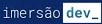
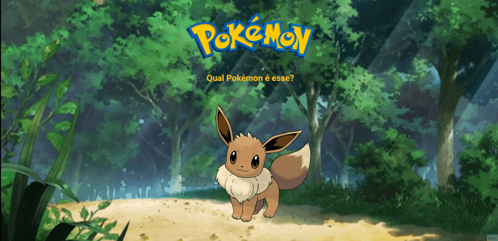
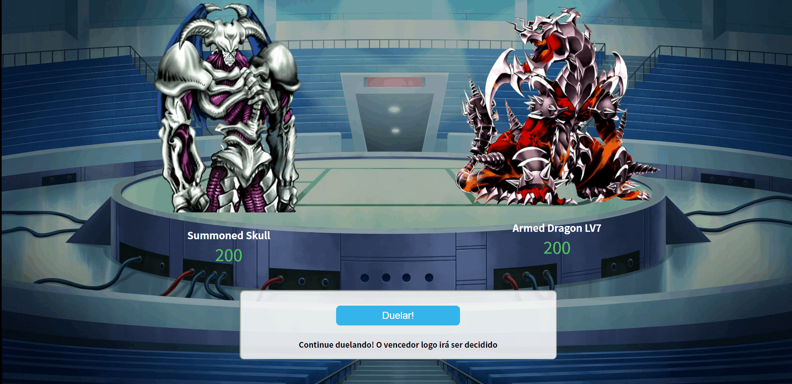

<h1 align="center">
    
     
     
    Repositótrios com os desafios da imersão Dev
</h1>

<h4 align="center">
    A imersão Dev foi uma semana de aulas gratuitas disponibilizadas pela Alura com as tecnologias HTML, CSS e JS. Esse repositótio contém os desafios propostos durante
    os 5 dias de imersão.
</h4>
 

    
    
    

 

#### 🚀 Tecnologias

 

Feito com 💖 por TamirysNogueira. [Get in Touch!](https://www.linkedin.com/in/tamirys-nogueira-346958205/)